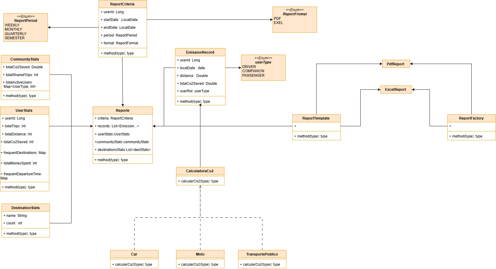
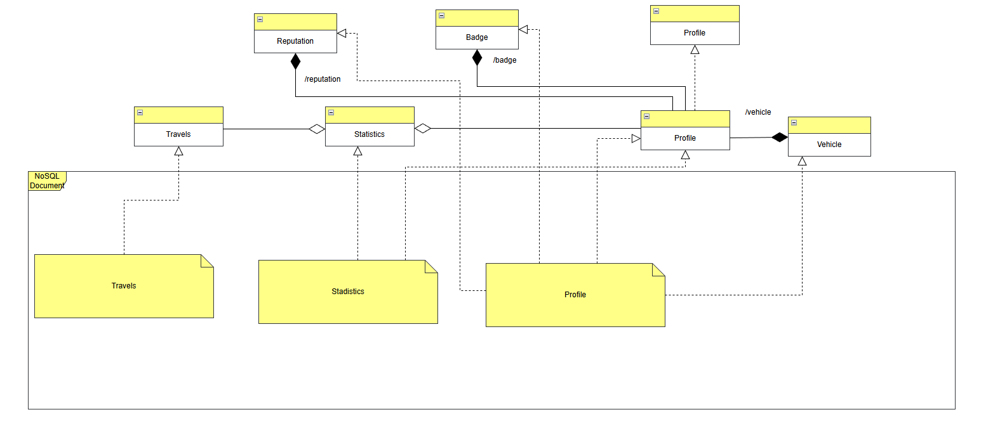
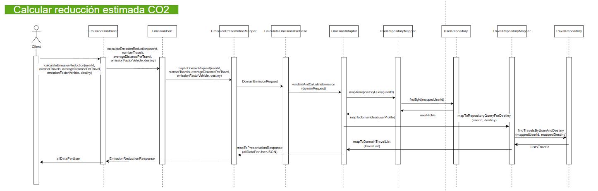
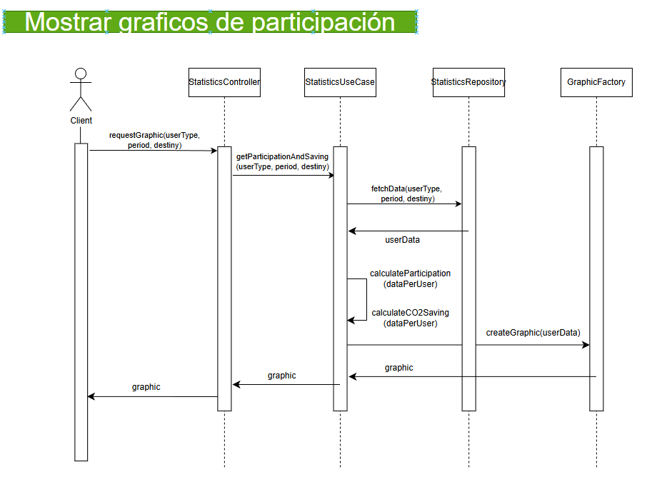
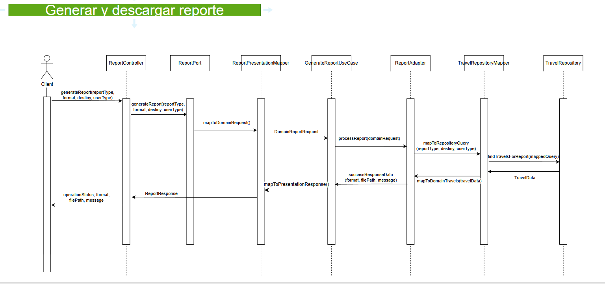
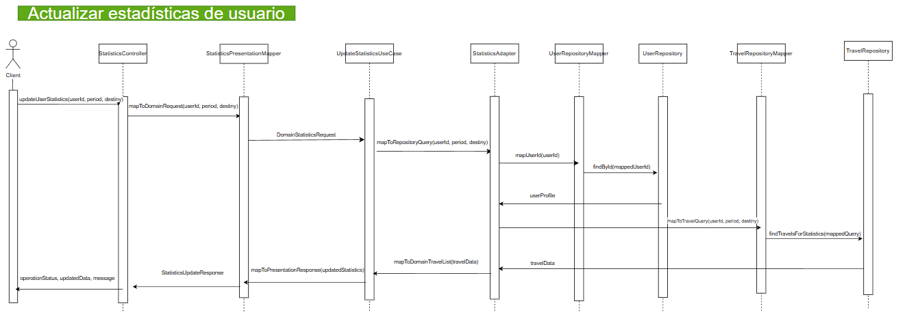

# 🐴 TROYA_STATISTICS_SUSTAINABILITY_BACKEND
The service's main objective is to measure and analyze the environmental and social impact of using RIDECI, providing key indicators that reflect CO₂ emission savings, the number of shared rides, and the level of community participation.

The system will automatically calculate the estimated emission reduction per user and present comparative graphs showing the collective savings achieved over different time periods. It will also allow the generation of detailed reports by week, month, or semester, with the option to apply filters based on user type or most frequent destination.

The results can be exported in PDF and Excel formats, facilitating analysis and institutional dissemination.

The module will also include a public dashboard highlighting the most relevant sustainability metrics, promoting transparency and the institution's environmental commitment to the community.

## 👥 Developers

- Julian Camilo Lopez Barrero
- Julian David Castiblanco Real
- Valeria Bermudez Aguilar
- Sebastian Enrique Barros Barros
- Santiago Suarez Puchigay
---

## 📑 Content Table

1. [Project Architecture](#-project-architecture)
    - [Hexagonal Structure](#-clean---hexagonal-structure)
2. [API Documentation](#-api-endpoints)
    - [Endpoints](#-api-endpoints)
3. [Input & Output Data](#input-and-output-data)
4. [Microservices Integration](#-connections-with-other-microservices)
5. [Technologies](#technologies)
6. [Branch Strategy](#-branches-strategy--structure)
7. [System Architecture & Design](#-system-architecture--design) 
8. [Getting Started](#-getting-started) 
9. [Testing](#-testing)

---

# 🏷️ Naming Conventions

# 🌿 Branches Strategy & Structure

This module follows a strict branching strategy based on Gitflow to ensure the ordered versioning,code quality and continous integration.


| **Branch**                | **Purpose**                            | **Receive of**           | **Sent to**        | **Notes**                      |
| ----------------------- | ---------------------------------------- | ----------------------- | ------------------ | ------------------------------ |
| `main`                  | 🏁 Stable code for preproduction or Production | `release/*`, `hotfix/*` | 🚀 Production      | 🔐 Protected with PR y successful CI   |
| `develop`               | 🧪 Main developing branch             | `feature/*`             | `release/*`        | 🔄 Base to continous deployment |
| `feature/*`             | ✨ New functions or refactors  to be implemented       | `develop`               | `develop`          | 🧹 Are deleted after merge to develop      |
| `release/*`             | 📦 Release preparation & final polish.      | `develop`               | `main` y `develop` | 🧪  Includes final QA. No new features added here.     |
| `bugfix/*` o `hotfix/*` | 🛠️ Critical fixes for production         | `main`                  | `main` y `develop` | ⚡ Urgent patches. Highest priority             |


## 📝 Commit Message Guidelines

We follow the **[Conventional Commits](https://www.conventionalcommits.org/)** specification.

### 🧱 Standard Format

```text
<type>(<scope>): <short description>
```

## 🏛️ Project Architecture

The Troya Reputation & Profiles have a unacoplated hexagonal - clean architecture where looks for isolate the business logic with the other part of the app dividing it in multiple components:

* **🧠 Domain (Core)**: Contains the business logic and principal rules.

* **🎯 Ports (Interfaces)**: Are interfaces that define the actions that the domain can do.

* **🔌 Adapters (Infrastructure)**: Are the implementations of the ports that connect the domain with the specific technologies. 

The use of this architecture has the following benefits:

* ✅ **Separation of Concerns:** Distinct boundaries between logic and infrastructure.
* ✅ **Maintainability:** Easier to update or replace specific components.
* ✅ **Scalability:** Components can evolve independently.
* ✅ **Testability:** The domain can be tested in isolation without a database or server.
* 
## 📂 Clean - Hexagonal Structure

```
📂 TROYA_STADISTICS_BACKEND
 ┣ 📂 src/
 ┃ ┣ 📂 main/
 ┃ ┃ ┣ 📂 java/
 ┃ ┃ ┃ ┗ 📂 edu/dosw/rideci/
 ┃ ┃ ┃   ┣ 📄 TroyaStadisticsBackendApplication.java
 ┃ ┃ ┃   ┣ 📂 domain/
 ┃ ┃ ┃   ┃ ┗ 📂 model/            # 🧠 Domain models
 ┃ ┃ ┃   ┣ 📂 application/
 ┃ ┃ ┃   ┃ ┣ 📂 ports/
 ┃ ┃ ┃   ┃ ┃ ┣ 📂 input/          # 🎯 Input ports (Exposed use cases)
 ┃ ┃ ┃   ┃ ┃ ┗ 📂 output/         # 🔌 Output ports (external gateways)
 ┃ ┃ ┃   ┃ ┗ 📂 usecases/         # ⚙️ Use case implementations
 ┃ ┃ ┃   ┣ 📂 infrastructure/
 ┃ ┃ ┃   ┃ ┗ 📂 adapters/
 ┃ ┃ ┃   ┃   ┣ 📂 input/
 ┃ ┃ ┃   ┃   ┃ ┗ 📂 controller/   # 🌐 Input adapters (REST controllers)
 ┃ ┃ ┃   ┃   ┗ 📂 output/
 ┃ ┃ ┃   ┃     ┗ 📂 persistence/  # 🗄️ Output adapters (persistance)
 ┃ ┃ ┗ 📂 resources/
 ┃ ┃   ┗ 📄 application.properties
 ┣ 📂 test/
 ┃ ┣ 📂 java/
 ┃ ┃ ┗ 📂 edu/dosw/rideci/
 ┃ ┃   ┗ 📂 tests/
 ┣ 📂 docs/
    ┣ 📂 img/
      ┣ diagramaClases.jpg
      ┣ diagramaDatos.jpg
      ┃ diagramaDespliegue.png
 ┣ 📄 pom.xml
 ┣ 📄 mvnw / mvnw.cmd
 ┗ 📄 README.md
```


# Technologies

The following technologies were used to build and deploy this module:

### Backend & Core


### Database


### DevOps & Infrastructure


### CI/CD & Quality Assurance


### Documentation & Testing


### Design 


### Comunication & Project Management


---

## Diagramas del Módulo

### Diagrama de Componentes Específico


Este diagrama muestra de forma sencilla cómo está organizado el backend encargado de las funciones de estadísticas y sostenibilidad. El flujo parte del frontend, que se comunica con el sistema a través del API Gateway. A partir de ahí, los componentes relacionados con el manejo de usuarios se encargan de obtener y validar la información necesaria consultando el módulo de gestión de usuarios y la base de datos.

Dentro del backend se distinguen dos bloques principales: el de sostenibilidad y el de estadísticas. Cada uno cuenta con su propio controlador, servicio y mapper, además de los casos de uso que atienden las funcionalidades específicas de cada área. El módulo de sostenibilidad agrupa todo lo relacionado con métricas ambientales y reportes, mientras que el de estadísticas reúne los procesos encargados de generar paneles, gráficos y datos analíticos.


---

### Diagrama de Clases




Este diagrama muestra la estructura principal del módulo encargado de generar reportes. En el centro se encuentra la clase **Report**, que reúne toda la información necesaria para construir un informe: criterios de búsqueda, registros de emisiones, estadísticas del usuario, de la comunidad y de destinos. Estos datos provienen de clases como **UserStats**, **CommunityStats** y **DestinationStats**, que encapsulan distintos tipos de métricas relacionadas con uso, viajes y ahorro de CO₂.

La clase **ReportCriteria** define los parámetros con los que se genera un reporte, como el período, las fechas y el formato deseado. También interviene la clase **EmissionRecord**, que representa cada registro de emisiones con datos como distancia recorrida, CO₂ ahorrado y tipo de usuario. Para calcular el impacto ambiental se utiliza la clase abstracta **CalculadoraCo2**, de la cual derivan implementaciones específicas para distintos medios de transporte, como **Car**, **Moto** y **TransportePublico**.

Finalmente, el diagrama incluye el componente encargado de generar el archivo final: una estructura basada en una plantilla (**ReportTemplate**) y dos implementaciones concretas, **PdfReport** y **ExcelReport**, gestionadas a través del **ReportFactory**, que decide qué tipo de reporte crear según el formato solicitado. En conjunto, el diagrama presenta una arquitectura orientada a objetos que separa claramente los datos, las reglas de negocio y la lógica de generación del informe.


---

### Diagrama de Bases de Datos



---

### Diagrama de Despliegue Específico del Módulo


---
### Diagramas de Secuencia


## Cálculo de reducción estimada de CO₂

Este diagrama de secuencia ilustra el recorrido completo que sigue la solicitud cuando un usuario pide calcular la reducción estimada de CO₂. El proceso comienza en el controlador, que recibe los datos del usuario y los transforma para que la lógica de negocio pueda utilizarlos. Luego, el caso de uso valida la información y solicita al adaptador que obtenga tanto el perfil del usuario como los viajes asociados al destino seleccionado. Con esos datos, el sistema realiza el cálculo correspondiente y genera una respuesta estructurada. Finalmente, la información procesada se devuelve al cliente en un formato claro y listo para ser presentado.



## Mostrar gráficos de participación

Este diagrama de secuencia describe el flujo que sigue el sistema cuando un usuario solicita ver los gráficos de participación. El proceso comienza cuando el cliente envía la petición al controlador indicando el tipo de usuario, el período y el destino. El controlador delega la solicitud al caso de uso, que se encarga de reunir toda la información necesaria. Para ello, consulta al repositorio de estadísticas, que devuelve los datos correspondientes. Con esa información, el caso de uso calcula tanto el nivel de participación como el ahorro de CO₂ asociado. Una vez procesados los datos, se envían a la fábrica de gráficos, que genera la visualización final. Finalmente, el gráfico producido vuelve al controlador y este lo entrega al cliente como resultado de la solicitud.



## Generar y descargar un reporte

Este diagrama de secuencia explica cómo el sistema gestiona la solicitud de generar un reporte en el formato y tipo que el usuario elija. El proceso se inicia cuando el cliente envía su petición al controlador, que a su vez la deriva a la capa de presentación para convertirla en un objeto entendible por la lógica de dominio. Una vez transformada, la solicitud llega al caso de uso encargado de generar el reporte, el cual consulta al adaptador para obtener los datos necesarios. Dicho adaptador prepara la consulta y la envía al repositorio de viajes,




## Actualizar Estadisticas del Usuario

Este diagrama de secuencia ilustra cómo el sistema procesa la solicitud para actualizar las estadísticas de un usuario. El flujo inicia cuando el cliente envía su petición al controlador, el cual la transforma mediante el mapper de presentación y la delega al caso de uso correspondiente. Desde allí se solicita al adaptador la información necesaria, comenzando por validar al usuario en el repositorio y luego obteniendo los datos de viaje a través del repositorio de viajes. Con esta información, el sistema genera las estadísticas actualizadas, las convierte nuevamente al formato de presentación y las devuelve al cliente como respuesta final.

---
# 🚀 Getting Started

This section guides you through setting ip the project locally. This project requires **Java 17**. If you have a different version, you can change it or we recommend using **Docker** to ensure compatibility before compile.

### Clone & open repository

``` bash
git clone https://github.com/RIDECI/TROYA_REPUTATION_BACKEND.git
```

``` bash
cd TROYA_REPUTATION_BACKEND
```

You can open it on your favorite IDE

### Dockerize the project

Dockerize before compile the project avoid configuration issues and ensure environment consistency.

``` bash
docker compose up -d
```

### Install dependencies & compile project

Download dependencies and compile the source code.

``` bash
mvn clean install
```

``` bash
mvn clean compile
```

### To run the project
Start the Spring Boot server

``` bash
mvn spring-boot:run
```

