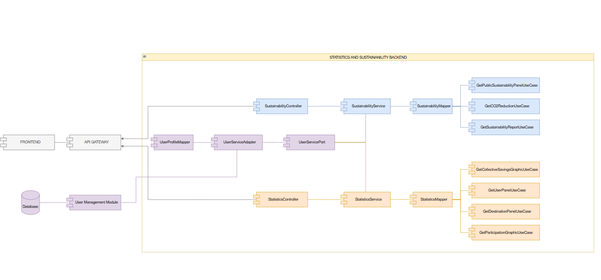
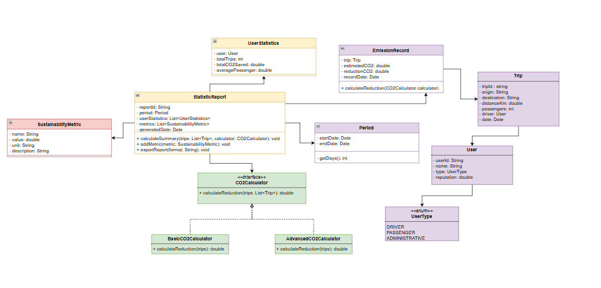
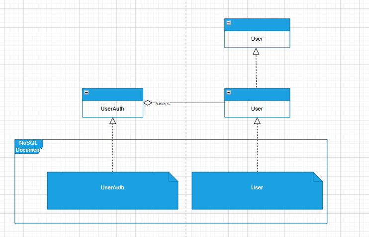
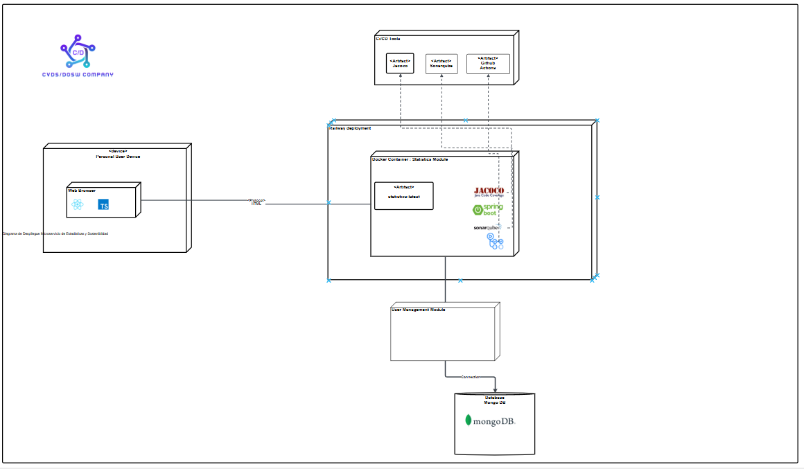

# 🐴 TROYA_STATISTICS_SUSTAINABILITY_BACKEND
The service's main objective is to measure and analyze the environmental and social impact of using RIDECI, providing key indicators that reflect CO₂ emission savings, the number of shared rides, and the level of community participation.

The system will automatically calculate the estimated emission reduction per user and present comparative graphs showing the collective savings achieved over different time periods. It will also allow the generation of detailed reports by week, month, or semester, with the option to apply filters based on user type or most frequent destination.

The results can be exported in PDF and Excel formats, facilitating analysis and institutional dissemination.

The module will also include a public dashboard highlighting the most relevant sustainability metrics, promoting transparency and the institution's environmental commitment to the community.

## 👥 Developers

- Julian Camilo Lopez Barrero
- Julian David Castiblanco Real
- Valeria Bermudez Aguilar
- Sebastian Enrique Barros Barros
- Santiago Suarez Puchigay
---

## Tabla de Contenidos

* [ Estrategia de Versionamiento y Branching](#-estrategia-de-versionamiento-y-branching)

    * [ Estrategia de Ramas (Git Flow)](#-estrategia-de-ramas-git-flow)
    * [ Convenciones de Nomenclatura](#-convenciones-de-nomenclatura)
    * [ Convenciones de Commits](#-convenciones-de-commits)
* [ Arquitectura del Proyecto](#-arquitectura-del-proyecto)

    * [ Estructura de Capas](#️-estructura-de-capas)
* [ Tecnologías Utilizadas](#️-tecnologías-utilizadas)
* [ Arquitectura Limpia - Organización de Capas](#️-arquitectura-limpia---organización-de-capas)
* [Diagramas del Módulo](#diagramas-del-módulo)


---

# 🏷️ Naming Conventions

# 🌿 Branches Strategy & Structure

This module follows a strict branching strategy based on Gitflow to ensure the ordered versioning,code quality and continous integration.


| **Branch**                | **Purpose**                            | **Receive of**           | **Sent to**        | **Notes**                      |
| ----------------------- | ---------------------------------------- | ----------------------- | ------------------ | ------------------------------ |
| `main`                  | 🏁 Stable code for preproduction or Production | `release/*`, `hotfix/*` | 🚀 Production      | 🔐 Protected with PR y successful CI   |
| `develop`               | 🧪 Main developing branch             | `feature/*`             | `release/*`        | 🔄 Base to continous deployment |
| `feature/*`             | ✨ New functions or refactors  to be implemented       | `develop`               | `develop`          | 🧹 Are deleted after merge to develop      |
| `release/*`             | 📦 Release preparation & final polish.      | `develop`               | `main` y `develop` | 🧪  Includes final QA. No new features added here.     |
| `bugfix/*` o `hotfix/*` | 🛠️ Critical fixes for production         | `main`                  | `main` y `develop` | ⚡ Urgent patches. Highest priority             |


## 📝 Commit Message Guidelines

We follow the **[Conventional Commits](https://www.conventionalcommits.org/)** specification.

### 🧱 Standard Format

```text
<type>(<scope>): <short description>
```

## 🏛️ Project Architecture

The Troya Reputation & Profiles have a unacoplated hexagonal - clean architecture where looks for isolate the business logic with the other part of the app dividing it in multiple components:

* **🧠 Domain (Core)**: Contains the business logic and principal rules.

* **🎯 Ports (Interfaces)**: Are interfaces that define the actions that the domain can do.

* **🔌 Adapters (Infrastructure)**: Are the implementations of the ports that connect the domain with the specific technologies. 

The use of this architecture has the following benefits:

* ✅ **Separation of Concerns:** Distinct boundaries between logic and infrastructure.
* ✅ **Maintainability:** Easier to update or replace specific components.
* ✅ **Scalability:** Components can evolve independently.
* ✅ **Testability:** The domain can be tested in isolation without a database or server.

## Estructura de Capas

📂 TROYA_STADISTICS_SUSTAINABILITY_BACKEND
 ┣ 📂 src/
 ┃ ┣ 📂 main/
 ┃ ┃ ┣ 📂 java/
 ┃ ┃ ┃ ┗ 📂 edu/dosw/rideci/
 ┃ ┃ ┃   ┣ 📄 TroyaStadisticsSustainabilityBackendApplication.java
 ┃ ┃ ┃   ┣ 📂 domain/
 ┃ ┃ ┃   ┃ ┗ 📂 model/            # 🧠 Domain models
 ┃ ┃ ┃   ┣ 📂 application/
 ┃ ┃ ┃   ┃ ┣ 📂 ports/
 ┃ ┃ ┃   ┃ ┃ ┣ 📂 input/          # 🎯 Input ports (Exposed use cases)
 ┃ ┃ ┃   ┃ ┃ ┗ 📂 output/         # 🔌 Output ports (external gateways)
 ┃ ┃ ┃   ┃ ┗ 📂 usecases/         # ⚙️ Use case implementations
 ┃ ┃ ┃   ┣ 📂 infrastructure/
 ┃ ┃ ┃   ┃ ┗ 📂 adapters/
 ┃ ┃ ┃   ┃   ┣ 📂 input/
 ┃ ┃ ┃   ┃   ┃ ┗ 📂 controller/   # 🌐 Input adapters (REST controllers)
 ┃ ┃ ┃   ┃   ┗ 📂 output/
 ┃ ┃ ┃   ┃     ┗ 📂 persistence/  # 🗄️ Output adapters (persistance)
 ┃ ┃ ┗ 📂 resources/
 ┃ ┃   ┗ 📄 application.properties
 ┣ 📂 test/
 ┃ ┣ 📂 java/
 ┃ ┃ ┗ 📂 edu/dosw/rideci/
 ┃ ┃   ┗ 📂 tests/
 ┣ 📂 docs/
    ┣ 📂 img/
      ┣ diagramaClases.jpg
      ┣ diagramaDatos.jpg
      ┃ diagramaDespliegue.png
 ┣ 📄 pom.xml
 ┣ 📄 mvnw / mvnw.cmd
 ┗ 📄 README.md

---

# Technologies

The following technologies were used to build and deploy this module:

### Backend & Core


### Database


### DevOps & Infrastructure


### CI/CD & Quality Assurance


### Documentation & Testing


### Design 


### Comunication & Project Management


---

## Diagramas del Módulo

### Diagrama de Componentes Específico




---

### Diagrama de Clases



---

### Diagrama de Bases de Datos



---

### Diagrama de Despliegue Específico del Módulo



---

# 🚀 Getting Started

This section guides you through setting ip the project locally. This project requires **Java 17**. If you have a different version, you can change it or we recommend using **Docker** to ensure compatibility before compile.

### Clone & open repository

``` bash
git clone https://github.com/RIDECI/TROYA_REPUTATION_BACKEND.git
```

``` bash
cd TROYA_REPUTATION_BACKEND
```

You can open it on your favorite IDE

### Dockerize the project

Dockerize before compile the project avoid configuration issues and ensure environment consistency.

``` bash
docker compose up -d
```

### Install dependencies & compile project

Download dependencies and compile the source code.

``` bash
mvn clean install
```

``` bash
mvn clean compile
```

### To run the project
Start the Spring Boot server

``` bash
mvn spring-boot:run
```

